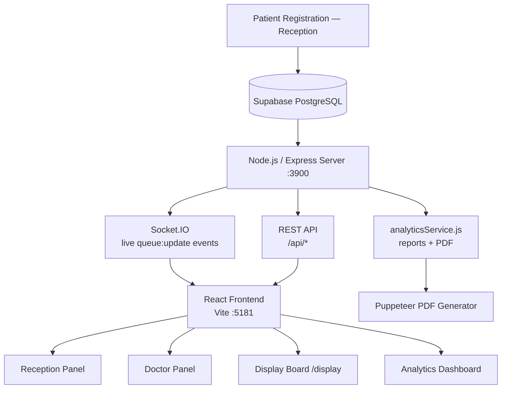

<div align="center">

# MediSync OPD
### Hospital Queue & Analytics Management System


*A multi-hospital OPD management system handling patient registration, queue tracking, and daily analytics — with live ETA, real-time sync across all roles, and automated PDF reporting.*

</div>

---

## Table of Contents

1. [Project Overview](#1-project-overview)
2. [System Architecture](#2-system-architecture)
3. [Tech Stack](#3-tech-stack)
4. [Core Features](#4-core-features)
   - [Queue & Role Management](#41-queue--role-management)
   - [Analytics & Display](#42-analytics--display)
5. [Monorepo Structure](#5-monorepo-structure)
6. [Getting Started](#6-getting-started)
7. [Impact & Real-World Benefits](#7-impact--real-world-benefits)
8. [Unique Implementation Details](#8-unique-implementation-details)
9. [Future Scope](#9-future-scope)

---

## 1. Project Overview

**Problem:** Hospitals manage OPD queues manually — no live visibility of wait times, no daily performance reports, no doctor workload data.

**Solution:** MediSync OPD gives every role in the OPD exactly the information they need, in real time:

| Role | What they see |
|---|---|
| **Receptionist** | Patient registration panel, full queue with filters, token issuance |
| **Doctor** | Live queue of their waiting patients, consultation timer, stats bar |
| **Display Board** | Dark-theme TV board showing live token queue — no login required |

The system covers the **full OPD lifecycle**:

```
Patient Arrives → Token Issued → Queue Tracked → Consultation Done → Analytics Recorded
```

**Five hospitals** share a single backend, each scoped by hospital code (e.g. `IND-AITR-01`) — no data leakage between hospitals.

---

## 2. System Architecture

### Data Flow

```
┌─────────────────────────────────────────┐
│         Patient Registration            │
│              (Reception)                │
└───────────────────┬─────────────────────┘
                    │
                    ▼
┌─────────────────────────────────────────┐
│              Supabase                   │
│  opd_tokens · opd_doctors               │
│  opd_departments · hospitals            │
└───────────────────┬─────────────────────┘
                    │
                    ▼
┌─────────────────────────────────────────┐
│     Node.js / Express OPD Server        │
│              port 3900                  │
└──────────┬──────────────┬───────────────┘
           │              │              │
           ▼              ▼              ▼
    Socket.IO        REST API       analyticsService
   (live updates)   /api/*         (reports + PDF)
           │              │
           ▼              ▼
   React Frontend    Puppeteer PDF
   (Vite, port 5181)
```

### Architecture Diagram (Mermaid)



### Key Architectural Decisions

- **Vite proxy** routes `/api/*` → `localhost:3900` — the frontend never exposes the backend port
- **Single `analyticsService.js`** shared by both the live dashboard API and the PDF generator — one source of truth, zero inconsistency
- **Socket.IO** pushes `queue:update` events so all connected clients refresh simultaneously with no page reload
- **OPD server (port 3900)** is isolated from the main backend (port 8080) — separate scope, separate concerns
- **Repository → Service → Controller** layering: repositories handle raw Supabase queries, services apply business logic, controllers expose clean API responses

---

## 3. Tech Stack

| Layer | Technology | Why / Evidence |
|---|---|---|
| **Frontend** | React 18 + Vite | `vite.config.js`, JSX components, `react-router-dom` route definitions |
| **Real-time** | Socket.IO | `socketManager.js`, `socket.js` lib, `queue:update` event |
| **Backend** | Node.js + Express | `server/index.js`, `opdRoutes.js`, `analyticsRoutes.js` |
| **Database** | Supabase (PostgreSQL) | `supabase.js` config, `supabase-js` queries across all repositories |
| **Charts** | Chart.js + react-chartjs-2 | `DashboardPage.jsx` — 7 chart modules rendered via react-chartjs-2 |
| **PDF Export** | Puppeteer | `pdfGenerator.js` — headless browser renders same Chart.js charts to PDF |
| **WebGL FX** | ogl (Triangle + Program) | `Prism.jsx` — custom GLSL ray-march fragment shader, not a CSS animation |
| **Notifications** | notificationService.js | SMS/WhatsApp queuing on token issue — non-blocking, async |

### Data Processing Pipeline

```
Supabase Query (Repository)
        ↓
  Business Logic (Service)
  · ETA calculation
  · Priority scoring
  · Efficiency metrics
        ↓
  API Response (Controller)
        ↓
  React UI / PDF
```

---

## 4. Core Features

### 4.1 Queue & Role Management

#### Multi-Step Login Flow

```
Step 1 → Select Hospital      (5 hospitals, e.g. IND-AITR-01)
Step 2 → Choose Role          (Reception | Doctor)
Step 3 → Select Department    (Doctor only — Cardiology, Orthopedics, Neurology, Pediatrics, General)
Step 4 → Select Doctor        (Doctor only — specific profile + room number)
```

#### Reception Panel

- Register patient: name, mobile, symptom category, priority reason
- Issues token with auto-assigned doctor, room, and live ETA
- **Priority auto-escalation:** Cardiac symptoms → immediate priority flag
- **Manual priority:** Elderly (65+), Pregnant
- Full queue table with department/status filters and cancel action

#### Doctor Panel

- Live queue of waiting patients with per-patient ETA
- **"Patient Entered"** — starts consultation timer
- **"Consultation Complete"** — marks done, triggers full ETA recalculation for all remaining patients
- Stats bar updated in real time: `Total / Waiting / Completed / Avg Time`

#### Live ETA — How It Works

```
ETA for Patient N =
  Σ (expected consultation time for patients 1..N-1 ahead in queue)

Expected time per patient =
  running average of that doctor's completed consultations today
  (recalculated every time a consultation ends)
```

The ETA is **not a static estimate** — it updates every time any doctor marks a consultation complete.

---

### 4.2 Analytics & Display

#### Analytics Dashboard — 7 Chart Modules

| Module | What it shows | Data source |
|---|---|---|
| Patient Load Over Time | Hour-by-hour patient volume | `opd_tokens.created_at` |
| Consultation Time | Avg time per doctor | `in_consultation` → `completed` timestamp delta |
| Waiting Time | Queue wait per patient segment | Token issue → consultation start |
| Age Distribution | Histogram of patient ages | `opd_tokens.patient_age` |
| Symptom Frequency | Count by symptom category | `opd_tokens.symptom_category` |
| Doctor Efficiency Matrix | Patients seen vs avg consult time | Doctor-level aggregation |
| Peak Delay vs Availability | Queue length vs active doctors | Time-series correlation |

#### Auto-Generated Insights (Text, Not Just Charts)

- Peak hour detection
- Doctor overload flagging
- Delay cause attribution — demand spike vs staff shortage

#### Patient Display Board

- Dedicated `/display` route — dark-theme TV-optimised board
- Shows live token queue per department
- **No login required** — plug into a waiting room screen and it just works

#### PDF Report Generation

```
GET /api/analytics/generate-pdf

1. Puppeteer launches headless browser
2. Injects Chart.js via CDN
3. Renders all 7 charts identically to live dashboard
4. Waits for window.__chartsReady === true flag
5. Captures full-page PDF
6. Returns as download
```

The PDF always matches what the screen shows — same rendering engine, same data.

---

## 5. Monorepo Structure

```
.
├── apps/
│   ├── opd/                     ← Main OPD app (this system)
│   │   ├── src/                 ← React frontend (Vite, port 5181)
│   │   │   ├── pages/
│   │   │   │   ├── ReceptionPage.jsx
│   │   │   │   ├── DoctorPage.jsx
│   │   │   │   ├── DisplayPage.jsx
│   │   │   │   └── DashboardPage.jsx
│   │   │   ├── components/
│   │   │   │   └── Prism.jsx    ← WebGL GLSL login screen
│   │   │   └── lib/
│   │   │       └── socket.js
│   │   └── server/              ← Node.js/Express OPD server (port 3900)
│   │       ├── index.js
│   │       ├── opdRoutes.js
│   │       ├── opdService.js
│   │       ├── opdRepository.js
│   │       ├── analyticsRoutes.js
│   │       ├── analyticsService.js
│   │       ├── analyticsRepository.js
│   │       ├── pdfGenerator.js
│   │       ├── socketManager.js
│   │       ├── notificationService.js
│   │       └── eventBus.js
│   ├── pwa/                     ← PWA patient-facing app
│   ├── hospital-hms-web/        ← HMS web portal
│   └── admin-dashboard-web/     ← Admin dashboard
├── backend/                     ← Main platform backend (port 8080)
│   └── src/
│       ├── server.js
│       ├── controllers/
│       ├── services/
│       ├── repositories/
│       └── routes/
└── hospital/                    ← Hospital portal (CRA)
```

---

## 6. Getting Started

### Prerequisites

- Node.js 18+
- A Supabase project with the OPD schema applied
- `.env` file in `apps/opd/server/` with `SUPABASE_URL` and `SUPABASE_ANON_KEY`

### Run OPD (Development)

```bash
# From apps/opd/
npm install

# Terminal 1 — backend server (port 3900)
npm run dev:server

# Terminal 2 — Vite frontend (port 5181)
npm run dev
```

### Run Main Backend

```bash
# From backend/
npm install
npm run dev
```

### Environment Variables

```
# apps/opd/server/.env
SUPABASE_URL=https://your-project.supabase.co
SUPABASE_ANON_KEY=your-anon-key
PORT=3900
```

---

## 7. Impact & Real-World Benefits

| Before | After |
|---|---|
| Paper token books | Digital token issuance with auto-assigned doctor + room |
| No wait time visibility | Live ETAs for patients and staff — reduces uncertainty and complaints |
| No workload data | Doctor efficiency matrix reveals overload before end of day |
| Manual daily reports | Full PDF analytics report auto-generated on demand |
| Discretionary priority | Cardiac and elderly patients flagged automatically |
| Per-hospital silos | 5 hospitals on one backend, scoped by hospital code |
| Staff manually refreshing screens | Socket.IO — no page refresh ever needed |

> The system reduces a receptionist's cognitive load by handling priority assignment, doctor routing, and ETA calculation — all automatically at token issue.

---

## 8. Unique Implementation Details

### Shared Analytics Pipeline

`analyticsService.js` is consumed by **both** the live REST API and the Puppeteer PDF generator. One module, one source of truth — the PDF is always analytically identical to the live screen.

### WebGL Login Screen

`Prism.jsx` renders a 3D prism geometry using a custom GLSL fragment shader with a **100-step ray-march loop**, instantiated via the `ogl` library (`Triangle` + `Program`). This is not a CSS animation or a pre-built library component.

```glsl
// Fragment shader — ray-march loop (simplified)
for (int i = 0; i < 100; i++) {
    float d = sceneSDF(rayPos);
    if (d < EPSILON) { /* hit */ break; }
    rayPos += rayDir * d;
}
```

### Puppeteer + Chart.js Synchronisation

The PDF generator injects Chart.js into a headless page and waits for a custom `window.__chartsReady` flag before capturing — making PDF generation reliable across all 7 chart types regardless of render time.

```js
// pdfGenerator.js — wait for charts to finish rendering
await page.waitForFunction(() => window.__chartsReady === true, { timeout: 10000 });
const pdf = await page.pdf({ format: 'A4', printBackground: true });
```

### Role-Scoped Architecture

Reception and Doctor views are separate React pages with separate API endpoints — no shared mutable state that could cause cross-role confusion or data leakage between roles.

### Dynamic ETA Recalculation

Every time a doctor marks a consultation complete, the server recalculates ETAs for all remaining patients in that doctor's queue using the doctor's updated running average. No static time estimates anywhere.

### Non-Blocking Notification Queue

`notificationService.js` queues SMS/WhatsApp alerts on token issue. The registration response is returned immediately — the notification is dispatched asynchronously so it never slows down the reception flow.

---

## 9. Future Scope

| Feature | Description |
|---|---|
| **Predictive Load** | Train on `opd_tokens` historical data to forecast patient volume per hour for proactive staffing |
| **Automated PDF Dispatch** | Schedule `generate-pdf` at end of day and email to hospital admin automatically |
| **PWA Integration** | The `pwa/` app in this monorepo is a natural extension — push live token status to patient's phone |
| **Cross-Hospital Analytics** | Aggregate dashboard across all 5 hospitals for network-level insights |
| **Doctor Performance Trends** | Week-over-week efficiency comparison, not just single-day snapshots |
| **Queue Overflow Alerts** | Auto-alert on-call administrator when waiting count crosses a threshold |
| **Full Patient Journey** | Extend schema to track post-consultation wait (pharmacy, lab) for end-to-end visibility |

> The PWA app already exists in the monorepo — connecting it to live token status notifications is the most immediately deployable next step.

---

<div align="center">

Built for Hack-a-Sprint

</div>
